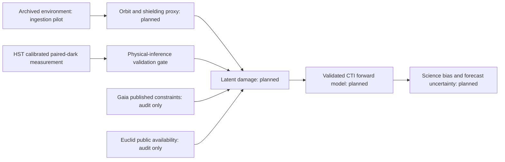

# LATTICE

Latent Astronomical Trap Tracking & Inference across Cosmic Environments

Can the external radiation environment help infer and forecast astronomical CCD damage after accounting for orbit, shielding, architecture, temperature, clocking, signal and calibration?

Author: **Biswajit Jana**.

Evidence status: **the calibrated HST longitudinal observable replicated; physical-inference gate closed pending nuisance-aware prediction**. The targeted literature audit, provenance infrastructure and tested extraction exist. No validated latent-state model, cross-mission forecast or science-bias result exists yet.

The historical sample uses 48 public ACS/WFC darks at eight epochs spanning 2003–2024: one development pair and two independently selected replication pairs per epoch. Official ACSCCD 10.4.1 bias/overscan calibration and gain conversion yield 102,604 primary peak measurements in the replication sample. All four pair-by-chip longitudinal slopes are positive with positive 95% epoch-bootstrap intervals, and none of 32 Bonferroni-adjusted blank-control intervals excludes zero. Development and replication summaries correlate at 0.9678, with mean absolute difference 0.0194. This is an observed longitudinal detector signal, not an inferred trap density or radiation-dose response. Background, post-flash, gain and engineering state remain strongly time-confounded, so the [replication assessment](results/hst_replication/assessment.json) keeps the physical-inference gate closed.

The [replication result note](docs/HST_REPLICATION_RESULTS.md) gives the screened slopes, repeatability measures, controls, provenance chain and remaining inference limits.




Verified local datasets: 54 checksum-pinned HST RAW images and matched SPT files, 21 pinned CRDS references and committed MAST metadata; 48 historical exposures are calibrated and six August 2025 holdout arrays remain sealed. OMNI hourly files for 2003, 2014 and 2023 are an ingestion pilot, not continuous exposure coverage. OMNI energetic-proton coverage ends in 2020, so later fill values cannot be interpreted as zero flux. Gaia calibration series and Euclid trap-pumping series have not been obtained. No plots were digitised.

Reproduce with Python 3.12:

```sh
python -m pip install -r requirements-tested.txt
python -m pip install -e '.[dev]'
pytest -q
lattice fetch-plan data/manifests/hst_raw_plan.json --max-mb 60
lattice verify data/manifests/hst_raw_plan_retrieved.json
python scripts/validate_hst.py
python scripts/analyze_hst.py
python scripts/assess_hst_gate.py
python scripts/extract_hst_telemetry.py
python scripts/verify_calibration.py
python scripts/analyze_hst.py --calibrated
python scripts/assess_calibrated_hst.py
# See docs/REPRODUCIBILITY.md for the replication-only calibration command.
python scripts/verify_calibration.py --receipt results/calibration/replication_products.json --raw-manifest data/manifests/hst_replication_raw_plan_retrieved.json --reference-manifest data/manifests/hst_references_plan_retrieved.json --reference-manifest data/manifests/hst_replication_references_plan_retrieved.json --assignments data/manifests/hst_replication_reference_assignments.json --required-role replication
python scripts/analyze_hst.py --products results/calibration/replication_products.json --output-dir results/hst_replication --figure-stem hst_replication_longitudinal --required-role replication
python scripts/assess_hst_replication.py
python scripts/compare_hst_cohorts.py
python scripts/summarize_hst_replication_nuisance.py
```

See [full reproduction instructions](docs/REPRODUCIBILITY.md). CI uses mock/synthetic inputs without mission downloads. The injection tests validate the extractor, not physical trap-parameter recovery. Nominal blank/serial intervals are retained even when they exclude zero; they are unadjusted diagnostics, not discovery tests. Temperature channels are preserved without an unverified active-sensor mapping, and the original signed x-axis control is not a serial-CTI estimator. The first research release remains incomplete. The website is deferred until the scientific pipeline passes its gates.

The [working manuscript](paper/main.tex) reports the HST replication outcome but makes no radiation-causation or cross-mission claim. Cite the software using [CITATION.cff](CITATION.cff) and credit original data and methods separately. Software is MIT licensed; mission-data rights remain source-specific.

See [project state](PROJECT_STATE.md), [build ledger](docs/BUILD_LEDGER.md), [data contract](docs/DATA_CONTRACT.md), [validation contract](docs/VALIDATION_CONTRACT.md) and [novelty audit](docs/NOVELTY_AUDIT.md).
