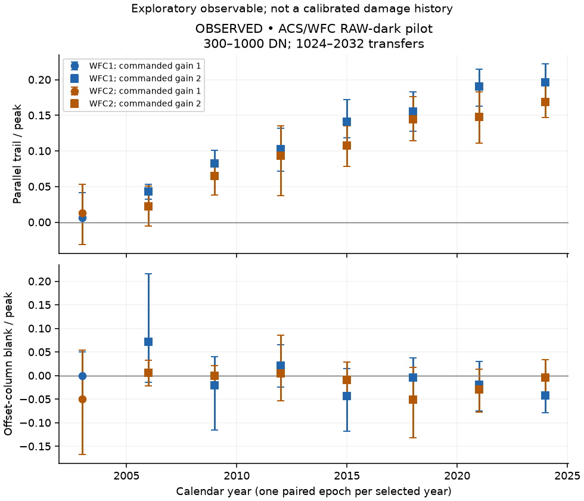
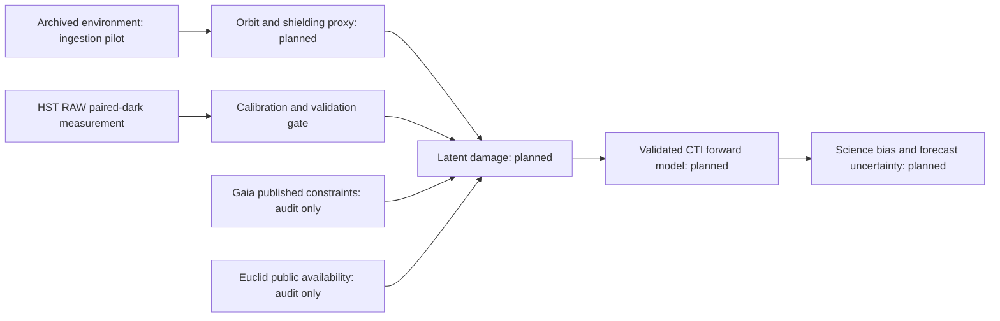

# LATTICE

Latent Astronomical Trap Tracking & Inference across Cosmic Environments

Can the external radiation environment help infer and forecast astronomical CCD damage after accounting for orbit, shielding, architecture, temperature, clocking, signal and calibration?

Author: **Biswajit Jana**.

Evidence status: **exploratory HST RAW-dark pilot; calibrated-anchor validation pending**. The targeted literature audit, provenance infrastructure and tested extraction exist. No validated latent-state model, cross-mission forecast or science-bias result exists yet.

The pilot uses 16 public ACS/WFC darks at eight epochs spanning 2003–2024, with 63,834 persistent peaks in the fixed primary selection. Native-DN trailing observables increase over the selected epochs, but gain changes, bias calibration, temperature and selection uncertainty prevent interpreting this as a physical damage history. These counts and the control checks are recorded in [the machine-readable gate assessment](results/hst/validation_gate.json).





Verified local datasets: checksum-pinned HST RAW images and MAST metadata; OMNI hourly files for 2003, 2014 and 2023. The OMNI selection is an ingestion pilot, not continuous exposure coverage. Gaia calibration series and Euclid trap-pumping series have not been obtained. No plots were digitised.

Reproduce with Python 3.12:

```sh
python -m pip install -r requirements-tested.txt
python -m pip install -e '.[dev]'
pytest -q
lattice fetch-plan data/manifests/hst_raw_plan.json --max-mb 60
lattice verify data/manifests/hst_raw_plan_retrieved.json
python scripts/validate_hst.py
python scripts/analyze_hst.py
python scripts/assess_hst_gate.py
```

See [full reproduction instructions](docs/REPRODUCIBILITY.md). CI uses mock/synthetic inputs without mission downloads. The injection tests validate the extractor, not physical trap-parameter recovery. Nominal blank/serial intervals are retained even when they exclude zero; they are unadjusted diagnostics, not discovery tests. The first research release remains incomplete. The website is deferred until the scientific pipeline passes its gates.

The [Methods/Data manuscript](paper/main.tex) has no populated empirical results section. Cite the software using [CITATION.cff](CITATION.cff) and credit original data and methods separately. Software is MIT licensed; mission-data rights remain source-specific.

See [project state](PROJECT_STATE.md), [build ledger](docs/BUILD_LEDGER.md), [data contract](docs/DATA_CONTRACT.md), [validation contract](docs/VALIDATION_CONTRACT.md) and [novelty audit](docs/NOVELTY_AUDIT.md).
