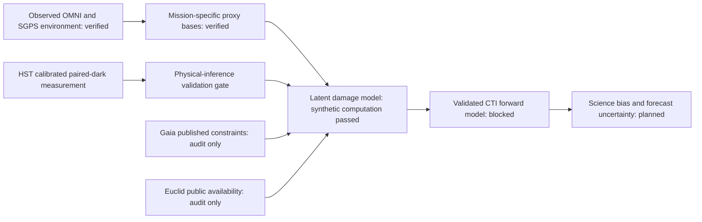

# LATTICE

Latent Astronomical Trap Tracking & Inference across Cosmic Environments

Can the external radiation environment help infer and forecast astronomical CCD damage after accounting for orbit, shielding, architecture, temperature, clocking, signal and calibration?

Author: **Biswajit Jana**.

Evidence status: **the calibrated HST longitudinal observable replicated, a continuous environment/proxy layer is verified, and the v3 exact-posterior method passes its frozen synthetic recovery and calibration gates; B0–B5 historical validation does not support an exposure improvement over calendar time**. This synthetic PASS validates computation under simulation, not detector physics. The physical-inference gate remains closed. No observational latent-state fit, cross-mission forecast or science-bias result exists.

The historical sample uses 48 public ACS/WFC darks at eight epochs spanning 2003–2024: one development pair and two independently selected replication pairs per epoch. Official ACSCCD 10.4.1 bias/overscan calibration and gain conversion yield 102,604 primary peak measurements in the replication sample. All four pair-by-chip longitudinal slopes are positive with positive 95% epoch-bootstrap intervals, and none of 32 Bonferroni-adjusted blank-control intervals excludes zero. Development and replication summaries correlate at 0.9678, with mean absolute difference 0.0194. This is an observed longitudinal detector signal, not an inferred trap density or radiation-dose response. Background, post-flash, gain and engineering state remain strongly time-confounded, so the [replication assessment](results/hst_replication/assessment.json) keeps the physical-inference gate closed.

The [replication result note](docs/HST_REPLICATION_RESULTS.md) gives the screened slopes, repeatability measures, controls, provenance chain and remaining inference limits. The [exposure result note](docs/EXPOSURE_RESULTS.md) documents the continuous environment layer and its measurement/proxy boundaries. The [baseline result note](docs/BASELINE_RESULTS.md) reports the frozen forward-chaining comparison and failure of the exposure-support screen. The [v1 synthetic recovery result](docs/SYNTHETIC_RECOVERY_RESULTS.md) retains the first failed latent-state gate, and the [paired ablation result](docs/CORE_ABLATION_RESULTS.md) diagnoses it. The [v2 result](docs/SYNTHETIC_RECOVERY_V2_RESULTS.md) records improved latent recovery and the process-scale SBC failure. The [v3 protocol](docs/CORE_MODEL_V3_PROTOCOL.md) freezes heavy-tailed exact-posterior sampling, and the [v3 result](docs/SYNTHETIC_RECOVERY_V3_RESULTS.md) records the subsequent synthetic PASS.




Verified local datasets: 54 checksum-pinned HST RAW images and matched SPT files, 21 pinned CRDS references and committed MAST metadata; 48 historical exposures are calibrated and six August 2025 holdout arrays remain sealed. The environment layer verifies 23 OMNI annual files and 1,883 GOES-R SGPS daily files, spanning 276 months through 2025. OMNI energetic-proton coverage ends on 2020-03-04 and SGPS begins in November 2020, so the intervening gap remains missing. The SGPS band-integrated series and all mission-response terms are labelled proxies, not physical dose. Gaia calibration series and Euclid trap-pumping series have not been obtained. No plots were digitised.


The historical benchmark holds out all four pair-by-chip strata at each of four future epochs. B0 calendar-linear gives the lowest RMSE (0.04024); B4 event-plus-background gives a slightly lower mean negative log predictive density but a slightly higher RMSE (0.04055). B3/B4 therefore fail the preregistered requirement to beat B0 on both metrics.


The first exact linear-Gaussian state-space specification converged in all 100
synthetic replicates, but its latent-state RMSE was 0.01721 against a frozen
0.0100 limit. Its prior predictive distribution placed 34.50% of values outside
the allowed range, and annealing and process-scale repeated-sampling ranks were
nonuniform. That fixed-truth rank check is now explicitly treated as a diagnostic,
with canonical prior-drawn SBC required by the v2 protocol.
The synthetic recovery gate therefore failed; the repository did not fit the
model to observational outcomes.


All 400 preregistered exact-zero ablation fits converged. Removing the event or
background response increased median paired BIC by 68.86 and 28.26; removing
annealing increased it by 12.77, while its latent-RMSE effect varied across
datasets. Process-noise removal had median ΔBIC 9.80 but increased median latent
RMSE by 33.5%. These simulated diagnostics guide a versioned model revision and
do not support an observational radiation claim.


V2 anchors the first observation pair and uses the frozen log-scale priors. In
100 fixed-truth datasets, latent RMSE improves to 0.00808 and every primary gate
passes. A separate 100-dataset canonical SBC experiment nevertheless rejects the
process-scale approximation: its rank-uniformity p-value is 6.40e-8. The model is
therefore still not eligible for an observational fit.


V3 keeps that model and replaces Gaussian Laplace posterior draws with an
exact-posterior, heavy-tailed independence Metropolis sampler. The frozen run
passes all nine top-level gates: 99/100 datasets have usable chains in each of
the fixed-truth and canonical SBC populations, overall interval coverage is
0.9688, latent RMSE is 0.00797, and all eight SBC rank checks pass. Process-scale
SBC improves from p=6.40e-8 in v2 to p=0.9114. This is a synthetic computational
result; observational and physical-inference gates remain closed.


Reproduce with Python 3.12:

```sh
python -m pip install -r requirements-tested.txt
python -m pip install -e '.[dev]'
pytest -q
lattice fetch-plan data/manifests/hst_raw_plan.json --max-mb 60
lattice verify data/manifests/hst_raw_plan_retrieved.json
python scripts/validate_hst.py
python scripts/analyze_hst.py
python scripts/assess_hst_gate.py
python scripts/extract_hst_telemetry.py
python scripts/verify_calibration.py
python scripts/analyze_hst.py --calibrated
python scripts/assess_calibrated_hst.py
# See docs/REPRODUCIBILITY.md for the replication-only calibration command.
python scripts/verify_calibration.py --receipt results/calibration/replication_products.json --raw-manifest data/manifests/hst_replication_raw_plan_retrieved.json --reference-manifest data/manifests/hst_references_plan_retrieved.json --reference-manifest data/manifests/hst_replication_references_plan_retrieved.json --assignments data/manifests/hst_replication_reference_assignments.json --required-role replication
python scripts/analyze_hst.py --products results/calibration/replication_products.json --output-dir results/hst_replication --figure-stem hst_replication_longitudinal --required-role replication
python scripts/assess_hst_replication.py
python scripts/compare_hst_cohorts.py
python scripts/summarize_hst_replication_nuisance.py
lattice fetch-plan data/manifests/omni_continuous_plan.json --max-mb 4
lattice fetch-plan data/manifests/goes_sgps_plan.json --max-mb 2
lattice verify data/manifests/omni_continuous_plan_retrieved.json
lattice verify data/manifests/goes_sgps_plan_retrieved.json
python scripts/build_exposure.py
python scripts/run_baselines.py
python scripts/run_synthetic_recovery.py --replicates 100 --workers 4
python scripts/run_core_ablations.py --workers 4
python scripts/run_synthetic_recovery_v2.py --replicates 100 --workers 4
python scripts/run_synthetic_recovery_v3.py --replicates 100 --workers 4
python scripts/run_historical_state_space.py
```

See [full reproduction instructions](docs/REPRODUCIBILITY.md). CI uses mock/synthetic inputs without mission downloads. The injection tests validate the extractor, not physical trap-parameter recovery. Nominal blank/serial intervals are retained even when they exclude zero; they are unadjusted diagnostics, not discovery tests. Temperature channels are preserved without an unverified active-sensor mapping, and the original signed x-axis control is not a serial-CTI estimator. The first research release remains incomplete. The website is deferred until the scientific pipeline passes its gates.

The [working manuscript](paper/main.tex) reports the HST replication outcome but makes no radiation-causation or cross-mission claim. Cite the software using [CITATION.cff](CITATION.cff) and credit original data and methods separately. Software is MIT licensed; mission-data rights remain source-specific.

See [project state](PROJECT_STATE.md), [build ledger](docs/BUILD_LEDGER.md), [data contract](docs/DATA_CONTRACT.md), [validation contract](docs/VALIDATION_CONTRACT.md) and [novelty audit](docs/NOVELTY_AUDIT.md).
