# LATTICE

Latent Astronomical Trap Tracking & Inference across Cosmic Environments

Can the external radiation environment help infer and forecast astronomical CCD damage after accounting for orbit, shielding, architecture, temperature, clocking, signal and calibration?

Author: **Biswajit Jana**.

Research interface: [LATTICE on GitHub Pages](https://biswajit1999.github.io/lattice-radiation-twin/)

Release outcome: [final research status](FINAL_RESEARCH_STATUS.md) — the bounded
first-release implementation is complete, while the radiation-attribution
hypothesis fails its historical and falsification gates.

Evidence status: **the calibrated HST longitudinal observable replicated and the v3 exact-posterior method passes synthetic recovery, but the exposure screen, historical state-space test, and first conditional science-bias measurement gate fail**. The transfer numerics conserve charge, while the frozen low-signal unweighted moment estimator retains only 8/32 valid pairs in the worst case. The physical-inference gate remains closed and no cross-mission or calendar forecast is supported.

The comprehensive falsification suite also fails: 5/11 directional tests pass,
and the exposure model wins both forecast scores on 35% of synthetic-null
permutations versus the frozen 10% maximum. This rejects radiation attribution
from the current sparse historical design; it does not negate the replicated
longitudinal detector measurement.

The historical sample uses 48 public ACS/WFC darks at eight epochs spanning 2003–2024: one development pair and two independently selected replication pairs per epoch. Official ACSCCD 10.4.1 bias/overscan calibration and gain conversion yield 102,604 primary peak measurements in the replication sample. All four pair-by-chip longitudinal slopes are positive with positive 95% epoch-bootstrap intervals, and none of 32 Bonferroni-adjusted blank-control intervals excludes zero. Development and replication summaries correlate at 0.9678, with mean absolute difference 0.0194. This is an observed longitudinal detector signal, not an inferred trap density or radiation-dose response. Background, post-flash, gain and engineering state remain strongly time-confounded, so the [replication assessment](results/hst_replication/assessment.json) keeps the physical-inference gate closed.

The [replication result note](docs/HST_REPLICATION_RESULTS.md) gives the screened slopes, repeatability measures, controls, provenance chain and remaining inference limits. The [exposure result note](docs/EXPOSURE_RESULTS.md) documents the continuous environment layer and its measurement/proxy boundaries. The [baseline result note](docs/BASELINE_RESULTS.md) reports the frozen forward-chaining comparison and failure of the exposure-support screen. The [v1 synthetic recovery result](docs/SYNTHETIC_RECOVERY_RESULTS.md) retains the first failed latent-state gate, and the [paired ablation result](docs/CORE_ABLATION_RESULTS.md) diagnoses it. The [v2 result](docs/SYNTHETIC_RECOVERY_V2_RESULTS.md) records improved latent recovery and the process-scale SBC failure. The [v3 result](docs/SYNTHETIC_RECOVERY_V3_RESULTS.md) records the subsequent synthetic PASS, while the [historical state-space result](docs/HISTORICAL_STATE_SPACE_RESULTS.md) retains the failed observational forecast and attribution gates.

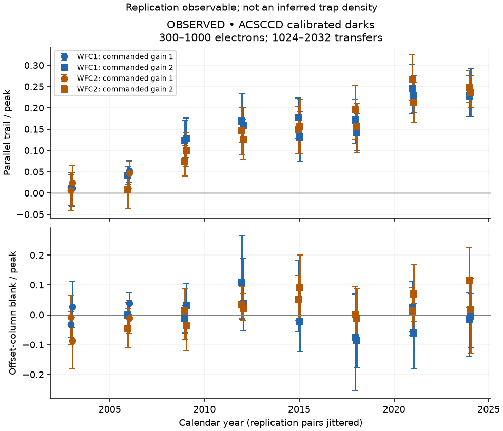

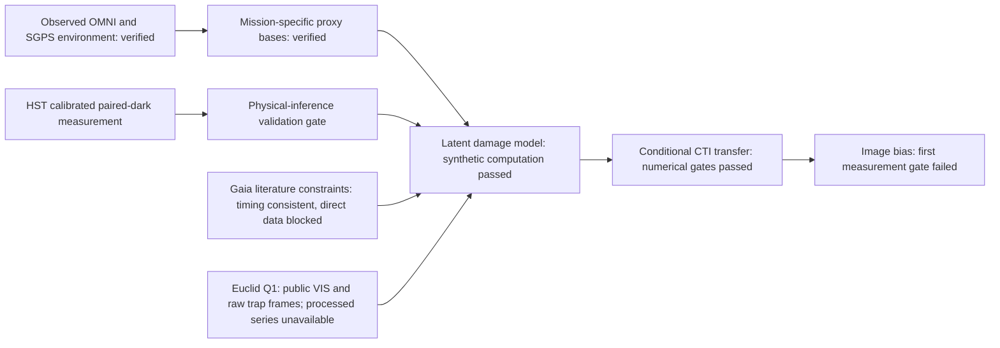

Verified local datasets: 54 checksum-pinned HST RAW images and matched SPT files, 21 pinned CRDS references and committed MAST metadata; 48 historical exposures are calibrated and six August 2025 holdout arrays remain sealed. The environment layer verifies 23 OMNI annual files and 1,883 GOES-R SGPS daily files, spanning 276 months through 2025. OMNI energetic-proton coverage ends on 2020-03-04 and SGPS begins in November 2020, so the intervening gap remains missing. The SGPS band-integrated series and all mission-response terms are labelled proxies, not physical dose. A live Gaia archive audit found no public CTI/engineering table among 248 tables. The Euclid Q1 archive contains 836 calibrated VIS frames and 36 raw parallel trap-pumping frames, while its processed trap and CTI time-series products are explicitly not distributed. No Euclid image was downloaded and no publication figure was digitised.

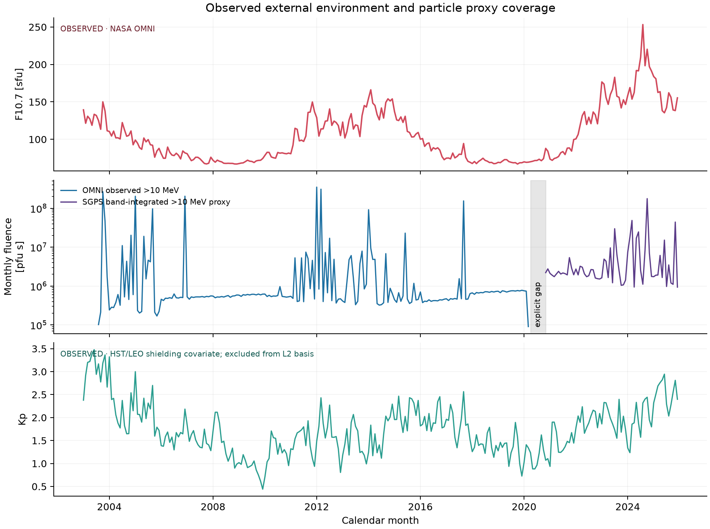

The historical benchmark holds out all four pair-by-chip strata at each of four future epochs. B0 calendar-linear gives the lowest RMSE (0.04024); B4 event-plus-background gives a slightly lower mean negative log predictive density but a slightly higher RMSE (0.04055). B3/B4 therefore fail the preregistered requirement to beat B0 on both metrics.

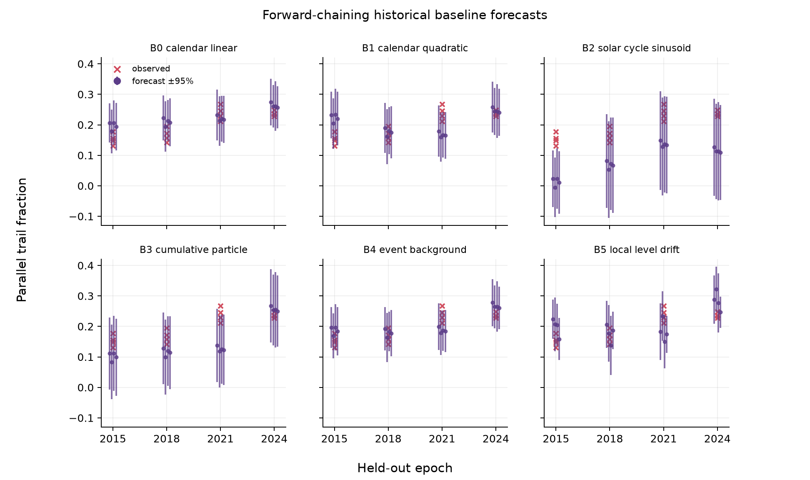

The first exact linear-Gaussian state-space specification converged in all 100
synthetic replicates, but its latent-state RMSE was 0.01721 against a frozen
0.0100 limit. Its prior predictive distribution placed 34.50% of values outside
the allowed range, and annealing and process-scale repeated-sampling ranks were
nonuniform. That fixed-truth rank check is now explicitly treated as a diagnostic,
with canonical prior-drawn SBC required by the v2 protocol.
The synthetic recovery gate therefore failed; the repository did not fit the
model to observational outcomes.

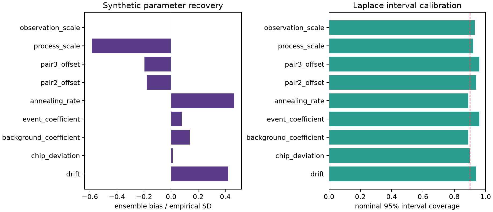

All 400 preregistered exact-zero ablation fits converged. Removing the event or
background response increased median paired BIC by 68.86 and 28.26; removing
annealing increased it by 12.77, while its latent-RMSE effect varied across
datasets. Process-noise removal had median ΔBIC 9.80 but increased median latent
RMSE by 33.5%. These simulated diagnostics guide a versioned model revision and
do not support an observational radiation claim.

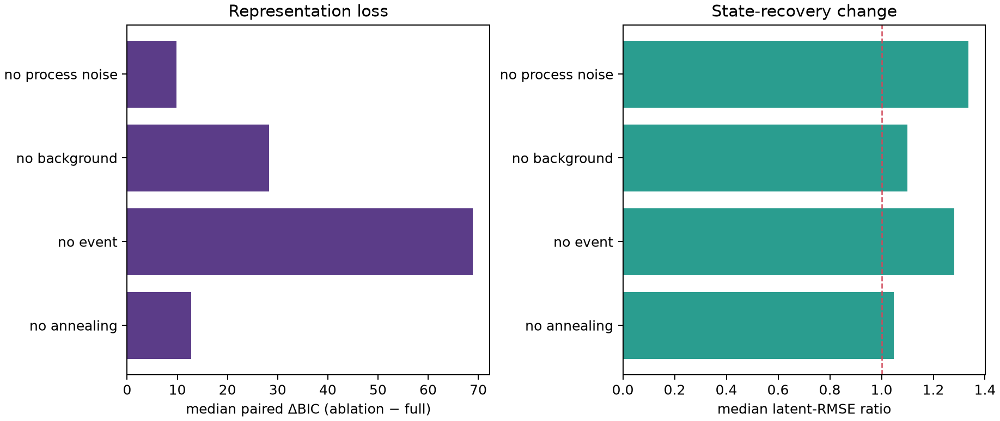

V2 anchors the first observation pair and uses the frozen log-scale priors. In
100 fixed-truth datasets, latent RMSE improves to 0.00808 and every primary gate
passes. A separate 100-dataset canonical SBC experiment nevertheless rejects the
process-scale approximation: its rank-uniformity p-value is 6.40e-8. The model is
therefore still not eligible for an observational fit.

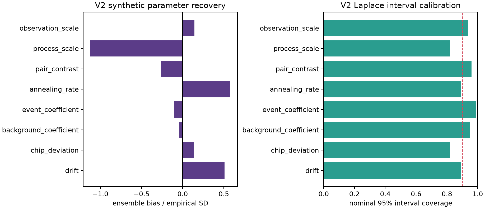

V3 keeps that model and replaces Gaussian Laplace posterior draws with an
exact-posterior, heavy-tailed independence Metropolis sampler. The frozen run
passes all nine top-level gates: 99/100 datasets have usable chains in each of
the fixed-truth and canonical SBC populations, overall interval coverage is
0.9688, latent RMSE is 0.00797, and all eight SBC rank checks pass. Process-scale
SBC improves from p=6.40e-8 in v2 to p=0.9114. This is a synthetic computational
result; observational and physical-inference gates remain closed.

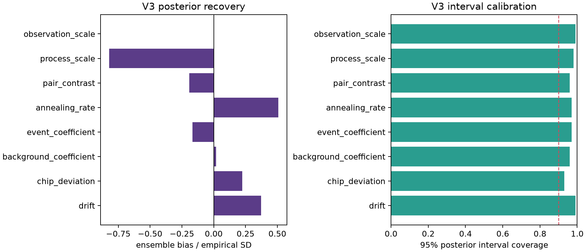

Applied to the four untouched historical forecast epochs, the primary v3
state-space model fails its preregistered complexity gate: RMSE is 0.04977 and
mean negative log predictive density is -1.6480. The exact-zero event model is
better on both metrics (0.03527 and -1.9286), so the primary event proxy is not
supported. No alternative is promoted after seeing these scores.

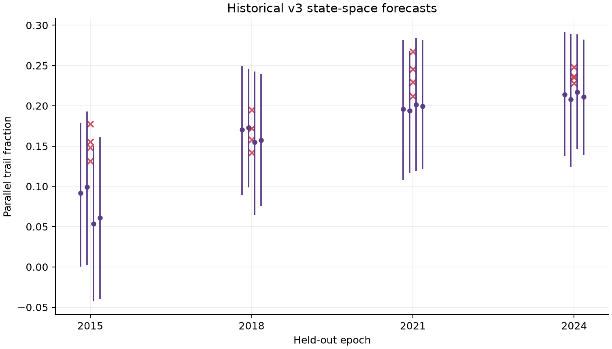

Gaia provides an external literature check rather than direct calibration-data
validation. The shared SEP proxy flags the reported September 2017 event and
ranks that month seventh among 200 OMNI months, but the official archive exposes
no CTI/engineering table found by the reproducible schema audit. The event
amplitude and cross-mission predictive comparison are therefore not tested.

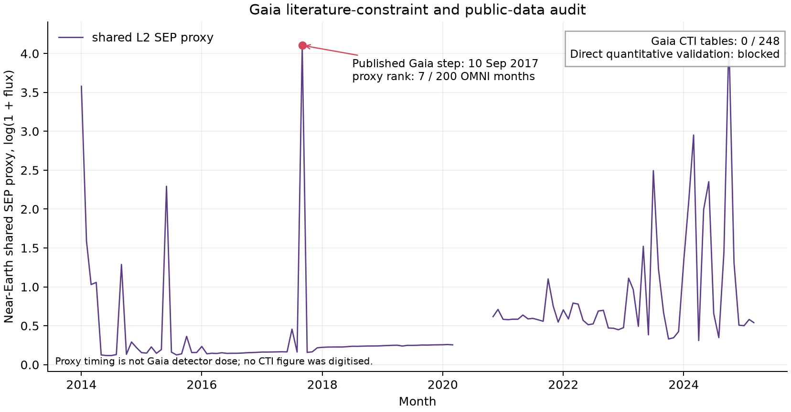

The Euclid archive supports a pixel-domain transfer experiment but does not yet
provide a processed damage amplitude. Its 36 public raw trap-pumping frames span
all 36 VIS CCDs per acquisition; reducing them into trap measurements requires a
separate, validated Euclid-specific pipeline. The frozen conditional transfer
passes charge-conservation and causality gates across 810 mission-specific
scenarios. Its capture fractions and timescale ranges are explicit sensitivity
values, so the output is not an observational damage or calendar forecast.

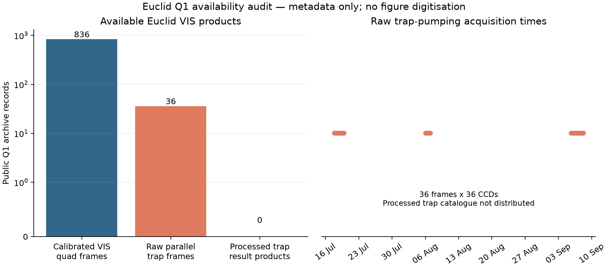

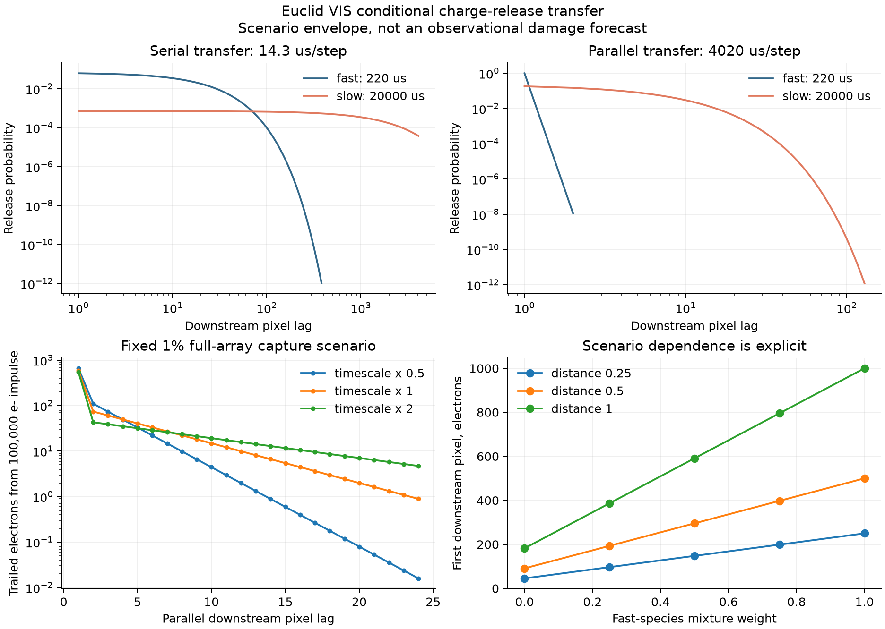

The first conditional detector-to-science-bias run retains a preregistered
failure. Its transfer calculation conserves charge to `4.55e-16`, but 369 of
432 source scenarios miss the required 30/32 valid paired moment measurements;
the worst retains 8/32. The low-signal ellipticity and size envelopes are thus
unstable diagnostics, not validated uncertainty intervals. See the
[science-bias result note](docs/SCIENCE_BIAS_RESULTS.md).

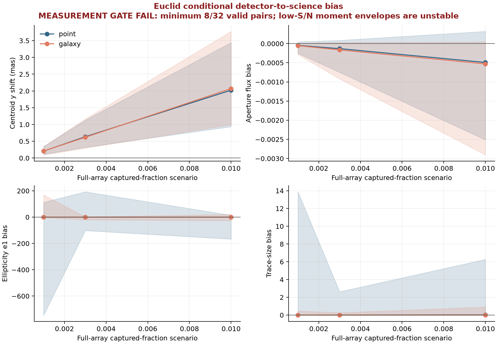

A separately frozen fixed-weight follow-up improves the worst valid count to
23/32 and leaves only 42/432 scenarios below threshold, but it also fails the
unchanged 30/32 gate. Its [result note](docs/SCIENCE_BIAS_WEIGHTED_RESULTS.md)
and output are retained rather than used to replace the first failure.

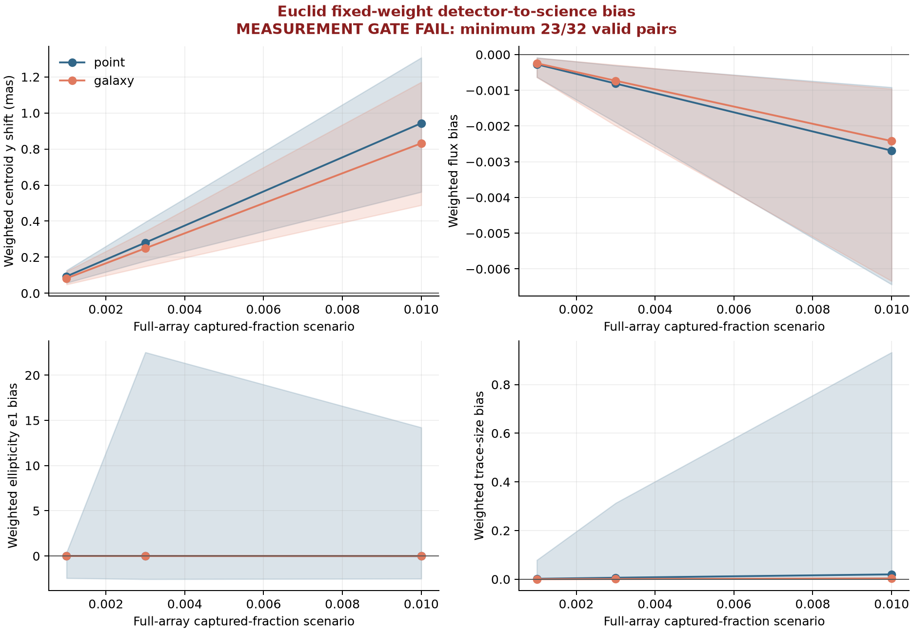

The third, independently preregistered experiment uses fixed-template linearized
response statistics and passes all implementation gates: 432/432 scenarios have
32/32 finite pairs and 54/54 ring tests are finite. Its conditional median
y-centroid response is `0.139` mas across the fixed grid. These are simulated
sensitivity responses without an observed CTI amplitude or posterior. See the
[forced-response result note](docs/SCIENCE_BIAS_FORCED_RESULTS.md).

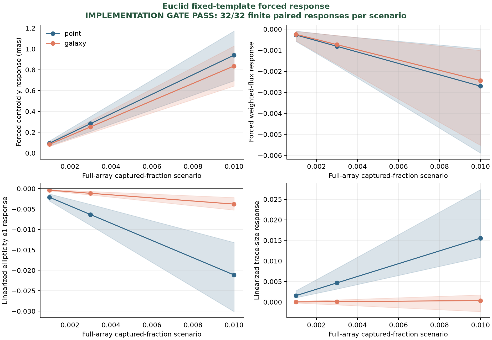

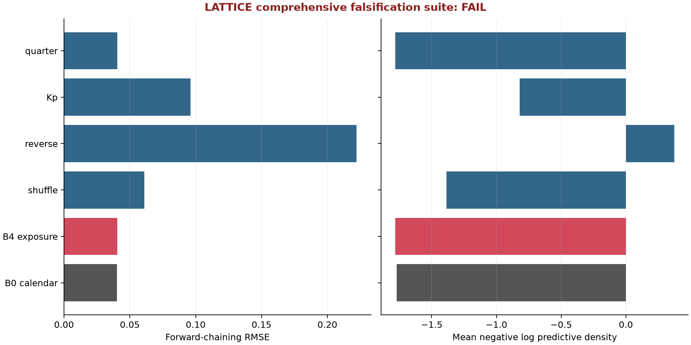

Reproduce with Python 3.12:

```sh
python -m pip install -r requirements-tested.txt
python -m pip install -e '.[dev]'
pytest -q
lattice fetch-plan data/manifests/hst_raw_plan.json --max-mb 60
lattice verify data/manifests/hst_raw_plan_retrieved.json
python scripts/validate_hst.py
python scripts/analyze_hst.py
python scripts/assess_hst_gate.py
python scripts/extract_hst_telemetry.py
python scripts/verify_calibration.py
python scripts/analyze_hst.py --calibrated
python scripts/assess_calibrated_hst.py
# See docs/REPRODUCIBILITY.md for the replication-only calibration command.
python scripts/verify_calibration.py --receipt results/calibration/replication_products.json --raw-manifest data/manifests/hst_replication_raw_plan_retrieved.json --reference-manifest data/manifests/hst_references_plan_retrieved.json --reference-manifest data/manifests/hst_replication_references_plan_retrieved.json --assignments data/manifests/hst_replication_reference_assignments.json --required-role replication
python scripts/analyze_hst.py --products results/calibration/replication_products.json --output-dir results/hst_replication --figure-stem hst_replication_longitudinal --required-role replication
python scripts/assess_hst_replication.py
python scripts/compare_hst_cohorts.py
python scripts/summarize_hst_replication_nuisance.py
lattice fetch-plan data/manifests/omni_continuous_plan.json --max-mb 4
lattice fetch-plan data/manifests/goes_sgps_plan.json --max-mb 2
lattice verify data/manifests/omni_continuous_plan_retrieved.json
lattice verify data/manifests/goes_sgps_plan_retrieved.json
python scripts/build_exposure.py
python scripts/run_baselines.py
python scripts/run_synthetic_recovery.py --replicates 100 --workers 4
python scripts/run_core_ablations.py --workers 4
python scripts/run_synthetic_recovery_v2.py --replicates 100 --workers 4
python scripts/run_synthetic_recovery_v3.py --replicates 100 --workers 4
python scripts/run_historical_state_space.py
python scripts/audit_gaia_availability.py
python scripts/audit_euclid_availability.py
python scripts/run_euclid_transfer.py
python scripts/run_science_bias.py
python scripts/run_science_bias_weighted.py
python scripts/run_science_bias_forced.py
python scripts/run_falsification_suite.py
python scripts/make_publication_figures.py
```

See [full reproduction instructions](docs/REPRODUCIBILITY.md). CI uses mock/synthetic inputs without mission downloads. The injection tests validate the extractor, not physical trap-parameter recovery. Nominal blank/serial intervals are retained even when they exclude zero; they are unadjusted diagnostics, not discovery tests. Temperature channels are preserved without an unverified active-sensor mapping, and the original signed x-axis control is not a serial-CTI estimator. The first research release remains incomplete. The website is deferred until the scientific pipeline passes its gates.

The [release-candidate manuscript](paper/main.tex) reports the HST replication,
failed attribution and falsification results, bounded cross-mission audits and
conditional science response. It makes no radiation-causation or cross-mission
amplitude claim. Cite the software using [CITATION.cff](CITATION.cff) and credit
original data and methods separately. Software is MIT licensed; mission-data
rights remain source-specific. The [publication audit](docs/PUBLICATION_AUDIT.md)
maps all eleven required figure roles to reproducible outputs.

The static React research interface is generated from compact provenance-linked
JSON. Rebuild it with `python scripts/export_web_data.py`, then run `npm ci &&
npm run build` inside `web`. The interface includes schematic 3D mission context,
mission-specific detector layouts, the observed HST timeline, conditional image
response and the complete falsification status table. Published dimensions,
device allocation and readout structure behind the animated focal-plane explorer
are documented in the [instrument geometry sources](docs/INSTRUMENT_GEOMETRY_SOURCES.md).

See [project state](PROJECT_STATE.md), [build ledger](docs/BUILD_LEDGER.md), [data contract](docs/DATA_CONTRACT.md), [validation contract](docs/VALIDATION_CONTRACT.md) and [novelty audit](docs/NOVELTY_AUDIT.md).
