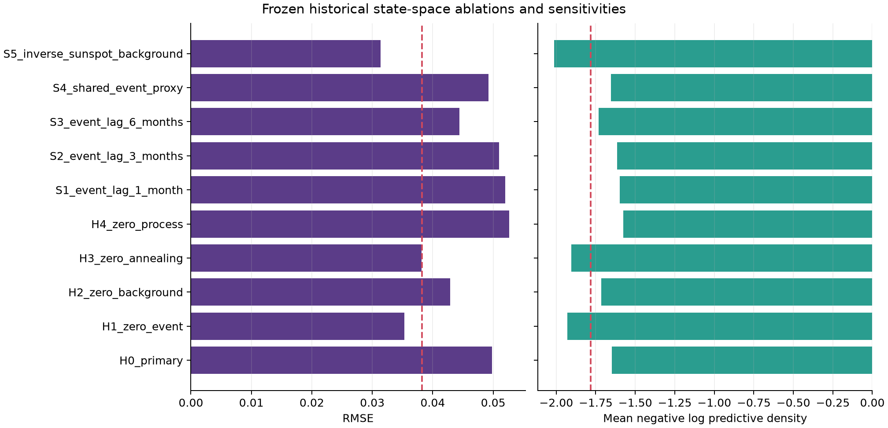

# Historical state-space validation result

Status: **FAILED — the advanced forecast and exposure-attribution gates do not
pass**.

The frozen historical experiment evaluated the primary v3 state-space model,
four exact-zero ablations and five lag/proxy sensitivities in the same four
whole-epoch folds as B0–B5. Inputs were limited to the 32 calibrated replication
summaries and the frozen monthly environment table. The complete result is
`results/core_model/historical_state_space.json`.

## Primary forecast gate

| Check | Frozen requirement | H0 result | Pass |
|---|---:|---:|:---:|
| Usable posterior chains | all four folds | 4/4 | yes |
| Complete finite forecasts | 16 | 16 | yes |
| RMSE | at most 0.0382313 | 0.0497744 | **no** |
| Mean negative log predictive density | below -1.78239 | -1.64805 | **no** |
| 95% interval coverage | at least 0.75 | 1.000 | yes |

H0 is worse than the calendar-linear B0 RMSE of 0.0402435 by 23.7%. Its perfect
interval coverage accompanies broad predictions and does not rescue the failed
point and density scores. The advanced-model forecast gate therefore fails.

## Ablations and sensitivities

Removing the event term improves RMSE to 0.0352699 and mean negative log
predictive density to -1.92864. H0 is worse on both preregistered comparisons, so
the HST event proxy is not supported. Removing the background term also improves
both scores, to RMSE 0.0428936 and density -1.71467, although its 2024 fold has
bulk ESS 80.9 and fails the per-fold usability rule. Exposure-attribution
robustness therefore fails for both event and background terms.

The zero-annealing diagnostic has RMSE 0.0381102 and density -1.90472. It cannot
replace H0 because all alternatives were frozen as diagnostics rather than
candidate selection. Removing process noise worsens RMSE to 0.0526717.

The 1-, 3- and 6-month event lags remain within 10% of H0 RMSE but do not make
the frozen primary specification pass. The shared-event-proxy 2015 fold has bulk
ESS 96.3. The inverse-sunspot alternative has attractive descriptive scores
(RMSE 0.0313565 and density -2.01441) but unusable 2015 and 2018 chains, including
maximum R-hat 1.138 and minimum bulk ESS 11.2 in 2018. It is not substituted for
the primary model and does not support a physical claim.

## Interpretation and boundary

The synthetically calibrated inference engine works under its simulated data-
generating assumptions, but this eight-epoch HST sample does not support the
prespecified environment-driven historical forecast. In particular, adding the
primary event proxy degrades prediction relative to its exact-zero model. This
could reflect proxy inadequacy, orbit/shielding mismatch, sparse epochs,
confounding, model misspecification or lack of a detectable event effect; the
experiment does not distinguish those explanations.

All nine provenance hashes match the executed script, model and sampler sources,
baseline score source, protocol, outcome/exposure inputs and v3 result. No
temporal-holdout pixel array was opened. The physical-inference gate and the
one-shot holdout remain closed. The failed result is retained without changing
the primary feature, thresholds or alternative-model roles.

